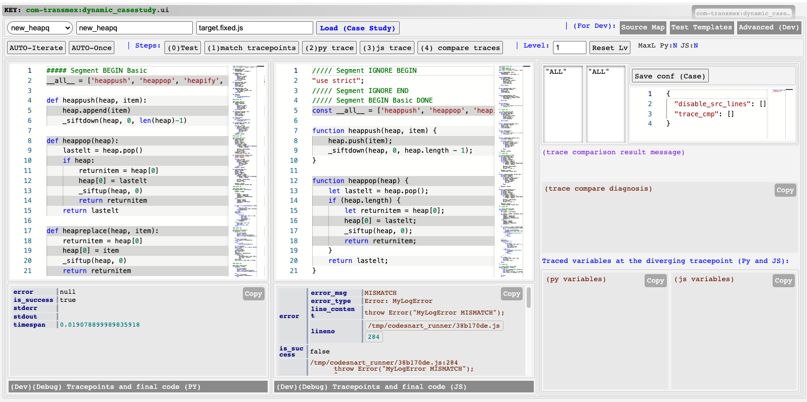
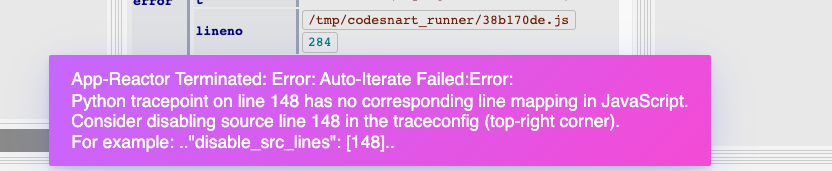
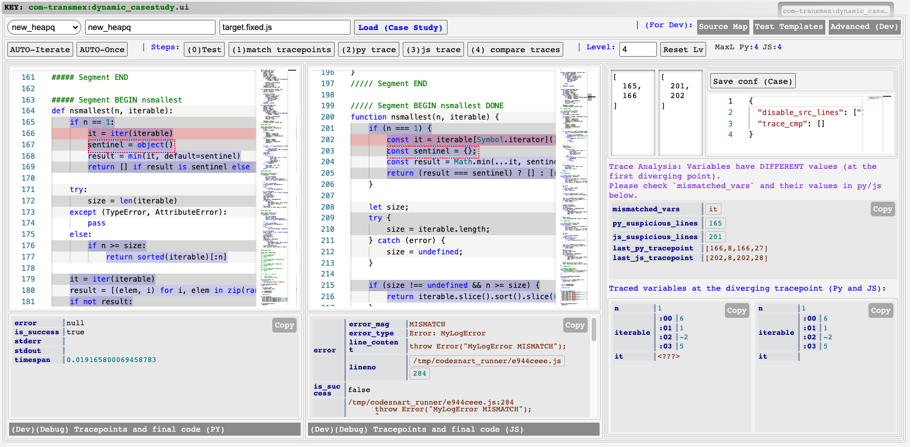
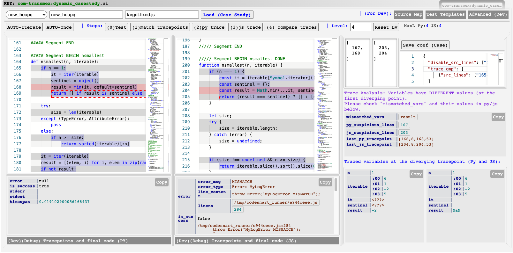
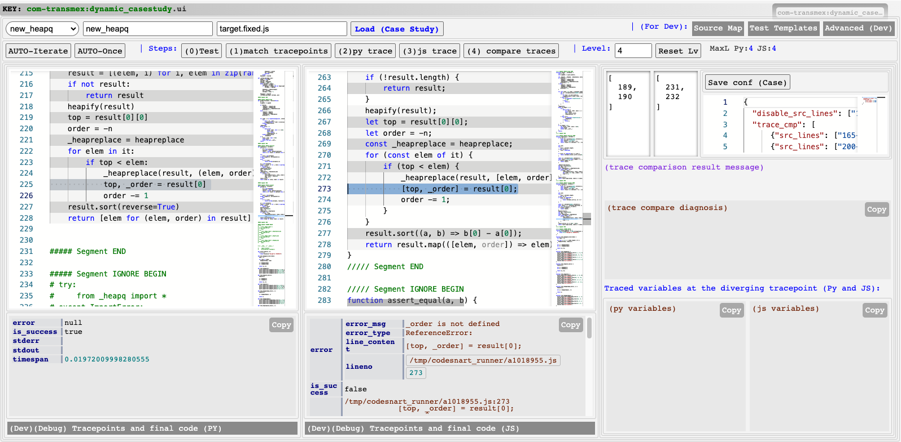

# TransMap Case Study

The details about the case study can be found in the paper (section 6.3) and the supplementary material (section 6). Here we explain the related files, the steps to conduct the case study, and the evaluation results.

## Overview

We select five Python libraries for the case study. Their summaries are described in the supplementary material (section 6.1).

Those Python libraries are converted into a format that TransMap accepts (`data/transmap/tests/evalex/real/py_js_codex0err/*`).  The original source files of the 5 python libraries are merged into into several self-contained Python programs, named `${lib_name}_${idx}`, e.g., `new_mathgen0`, `new_mathgen1`, etc. We have already use the Python scripts in `data/transmap/tests/cases` to translate them into JavaScript programs and generate the initial source map.

This case study is to check how effective is the TransMap approach in finding hidden semantic mistakes given the translation. After finding each mistake, we will fix the bug, save the updated JavaScript program and the source map, and then tun TransMap again to find the next bug. Thus, we will apply a sequence of patches to the code. 

We have provided the file patches for each of the spotted mistakes. See the `Example Workflow` section below about how to use TransMap to find all the hidden semantic mistakes and finally generate the final JavaScript program that pass tests.

## Steps to conduct the case study

Here we use `new_heapq` as an example to explain how to conduct the case study step by step. The details about the files in the folder and the preprocessing are explained in the later sections.

### Loading the case study in TransMap UI

**Step i:** Open the TransMap UI for case study (mentioned in [INSTALL](./INSTALL.md)). Choose `new_neapq` in the drop down menu. Click `Load (Case Study)` button to load the programs and the source map. 



**Step ii: Test the program.** Click `(0) Test` button to run them. It shows that Python code can successfully run but JavaScript code has test output  mismatch error (indicating a hidden semantic mistake somewhere in the code). 

**Step iii: Call TransMap.** Click `Auto-Iterate`. It shows the following error message:



This indicates that some statements cannot be traced (the source map of some complicated statements are unclear).

**Step iv(a): Update TransMap Config for this Case Study.**

We can skip tracing such lines by changing the config file. 
We simulate such a modification by applying the first patch in the `pathes/patch_apply_sequence`, a.k.a. `srcmap-01.patch`. 

In short, just run the following command to simulate a change:

```
git apply ./patches/srcmap-01.patch
```
and then go back to `Step i` to reload the case study.

It is equivalent to adding `"disable_src_lines": [148]` in the top right corner of the user interface and click `Save conf (Case)`. 


**Step i and ii:** Reload the case study. Click `Load (Case Study)` button to reload the programs and the source map.

**Step iii: Call TransMap to find the bug** Click `AUTO-Iterate`. This time it shows the following:


The suspicious lines are highlighted in shaded red. The dotted Python statement is the "breakpoint" of which the local variable values at that point are shown in the bottom-right corner. 

The analysis results on the right in purple says that TransMap finds that variables have different values at the "breakpoint" (between Python and JavaScript). The values of `i` is different. Looking at the corresponding source, the `i` actually starts from `n//2-1` and the bottom-right panel also shows that `i` is smaller than the `i` in JavaScript by 1. Thus, line 40 of JavaScript (the suspicious line) needs a fix:
```
-    for (let i = Math.floor(n / 2); i >= 0; i--) {
+    for (let i = Math.floor(n / 2) - 1; i >= 0; i--) {
```

**Step iv(b): Fix the bug and update source map.**

We simulate the fix by running the following command to apply the 2nd patch in the `patch/patch_apply_sequence`, a.k.a. `tp-01.patch` (revert the first one first):

```
git apply -R ./patches/srcmap-01.patch
git apply ./patches/tp-01.patch
```

Then go back to **step i** to reload and find the next bug.

**step i and ii:** Reload and then test the program again. There is another test output mismatch error. 

**step iii:** Click `AUTO-Iterate` again. This time it shows the following:



It says that the value of variable `it` is different between Python and JavaScript. However, a careful look at the bottom right corner shows that `it` is a iterator and TransMap hasn't supported the comparison of iterators. This is a false positive. Similarly, `sentinel` on the next line also has the same issue.

**step iv(a): Update trace config.**
We can disable the trace compasion of the variable `it`. We can simulate the change by applying the 3rd patch in the `patch/patch_apply_sequence`, a.k.a. `fp-01.patch`:

```
git apply -R ./patches/tp-01.patch
git apply ./patches/fp-01.patch
```

This patch will add `{"src_lines": ["165-193"], "vars_ignore": ["it", "sentinel"]}` to the config file to ignore the variables in trace comparison.

Then go back to **step i** to reload and find the next bug.

**step i, ii, iii:** Reload and `AUTO-Iterate` again. This time, TransMap reports the following:



Similar as the first one, this is indeed the bug location (This time it finds the `result` variable has different value (`-2` and `NaN`)). The fix is to change the suspicious line 204 of JavaScript shaded in red.

**Step iv(b): Fix the bug and update source map.**

Similar as above, do the following to simulate the fix:

```
git apply -R ./patches/fp-01.patch
git apply ./patches/tp-02.patch
```

Then go back to **step i** to reload and find the next bug.

This goes on and on until all the bugs are fixed. The final JavaScript program should be the same as the one in `target.fixed.archive.js`.

**NOTE:** If in **step i** it shows a runtime error, such as the following (after applying `tp-05.patch`):



Then you can simply go to the reported line number at the bottom by the test runner. It says `_order is not defined`. This is not a hidden semantic mistake and we don't bother to run TransMap in this case. We simply fix it by declaring `_order` (see `@@ -479,7 +492,7 @@` in the patch `rt-01.patch`).

**NOTE:** One of the mistake is missing due to tracer timeout. It turns out to be a dead loop in the code. This can be detected with a better tracer implementation. However, we count it as a failure of TransMap in this case study (refer to `miss-01.patch`).

After fixing all the mistakes, the final `target.fixed.js` will pass the tests (`is_success: true` in the test result). For all the hidden semantic mistakes, we count the number of them that TransMap successfully find as TP and the mistakes that spotted by TransMap but actually not a mistake (due to unsupported types) as FP. 

We do the same for other case studies, such as `colorsys`, `html`, etc. This results in Table 2 of the paper.


## Details about the files and preprocessing

- `source.py`: A standalone Python program. We split this code into segments (using comments in the code) with lengths of around 50 lines while preserving the boundaries of classes and functions. Each segment can be a normal segment or an ignore segment (will not be translated automatically). A normal segment is a segment noted with `##### Segment BEGIN <segment_name>` and `##### Segment END`. An ignore segment is a segment noted with `##### Segment IGNORE BEGIN` and `##### Segment END`.
- `target_fixed.js`: supplementary material (section 6.2); maybe note the path of translating script.
- `source_test.py` and `target_test.js`: The wrapper code to run the source and target programs, similar to the micro benchmarks. However, for case studies, we put the tests in the source code and the target code. Thus, the wrappers are empty.
- `target_tmpl.js`: The template file for generating the translated JavaScript. It contains the tests and empty segments to be filled by translating from the corresponding segments in `source.py`. 
- `target.fixed.js` and `target.fixed.archive.js`: The JavaScript program to be fixed and the archive of the fixed JavaScript program. TransMap will work on `target.fixed.js` and update it. Eventually the fully fixed code will be the same as `target.fixed.archive.js`.   
    **NOTE:** At the beginning, `target.fixed.js` is copied from `target.rawchatgpt.js` with syntax mistakes fixed. We use TransMap to then debug the remaining semantic mistakes in it.

The preprocessing scripts (which is already done) are provided in `data/transmap/cases`. To generate the JavaScript translations, run `python3 classic_translate.py`. To generate the initial source mapping, run `python3 classic_srcmapping.py`. After that, we copy the `*.rawchatgpt.js` to `target.fixed.js` and fix all syntax mistakes (and update source maps accordingly). Then TransMap is ready to debug the remaining semantic mistakes.
