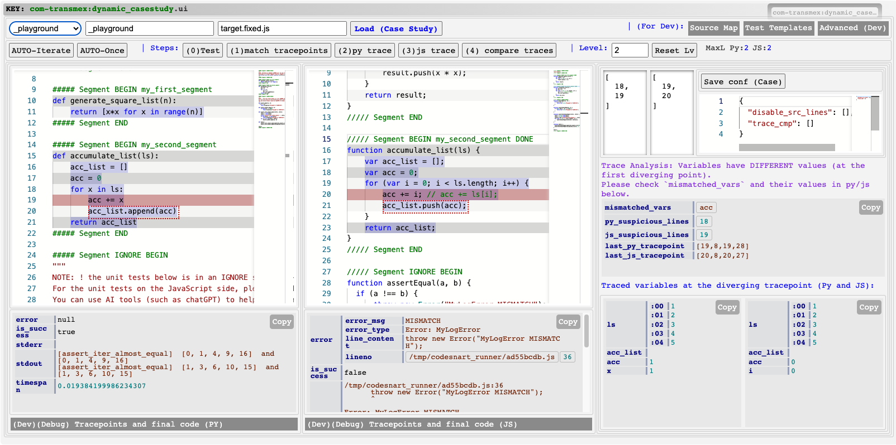

# Use TransMap on Your Own Python Program

To apply TransMap to your own Python program, you need to prepare the following files (you can look at the example at `data/transmap/tests/evalex/real/py_js_codex0err/_playgound`).

You need to prepare these two files at least:   

- `source.py`: The Python program to be translated.
- `target_tmpl.js`: The JavaScript program template used for generating the translation `target.js`.

**NOTE:** If you put the tests in `source.py` and `target_tmpl.js`: as `_playground` does, you don't need to modify `source_test.py` and `target_test.py` and you can ignore these two files.

## Demonstrate the Process on `_playground`

1. First go to the `_playground folder` mentioned above.

2. Open `source.py`. There are multiple segments in the file.

3. Put some Python code in `my_second_segment`. For example,

```python
##### Segment BEGIN my_second_segment
def accumulate_list(ls):
    return []
    acc_list = []
    acc = 0
    for x in ls:
        acc += x
        acc_list.append(acc)
    return acc_list
##### Segment END
```

4. Then, add test code on line 48:

```python
    assert_iter_almost_equal(accumulate_list([1, 2, 3, 4, 5]), [1, 3, 6, 10, 15])
```

5. Then, open `target_tmpl.js` and add the same test on line 48:

```javascript
    assertIterAlmostEqual(accumulate_list([1, 2, 3, 4, 5]), [1, 3, 6, 10, 15]);
```

6. Open a shell under `data/transmap/cases/`. Check the content of `openai.key`. It should be a valid OpenAI API key. If not, please refer to `Additional Requirements 2` in `INSTALL.md` to set up the API key.

7. Run the following commands under `data/transmap/cases/`:

```
python3 ./classic_translate.py playground
python3 ./classic_srcmapping.py playground
```

8. Then, you should be able to see the translated JavaScript at `target.rawchatgpt.js` and the source map at `target.rawchatgpt.js.srcmap`. 

9. Copy those two files to `target.fixed.js` and `target.fixed.js.srcmap`. Then, open the TransMap UI for Case Studies (mentioned in [INSTALLATION](./INSTALL.md)). Choose `_playground` in the drop-down menu at the top. Click `Load (Case Study)`. 

10. Then, click `(0) Test` to check if the code can run. If it shows that there is a `MyLogError MISMATCH` error, it indicates that there is a hidden semantic mistake in the translated code. You can click `AUTO-Iterate` to use TransMap to find the bug.

**NOTE:** If the translated code already pass the test, you can either find a more challenging Python program or manually introduce a hidden semantic mistake to check if TransMap works. For example, you can change the `acc += ls[i];` in the JavaScript translation into `acc += i;` and TransMap should be able to highlight this line: 

