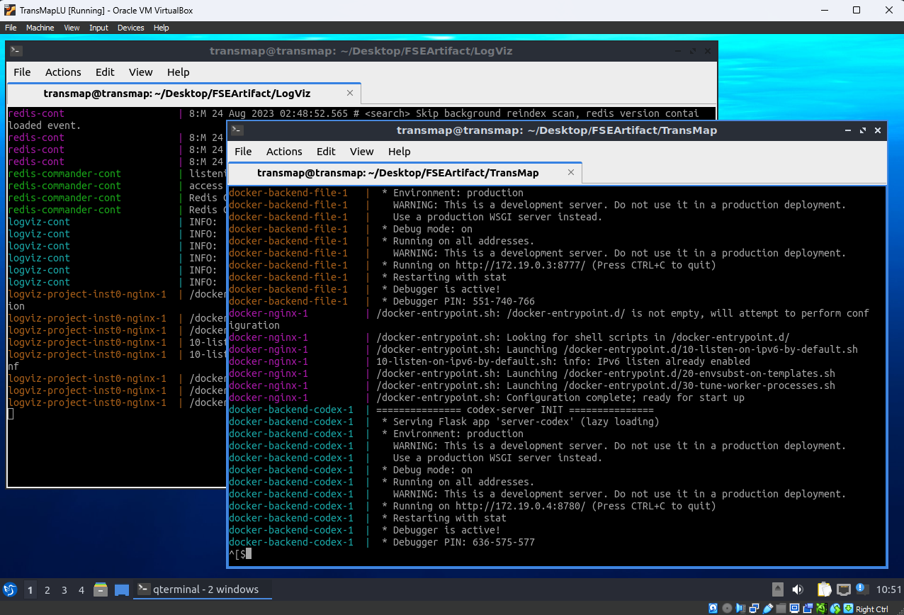
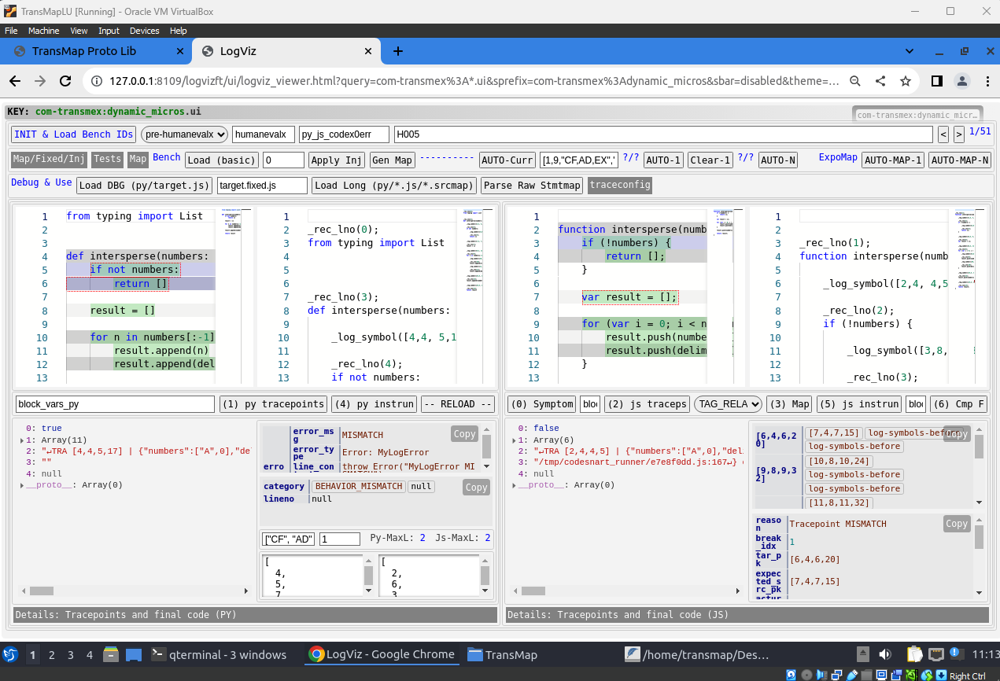
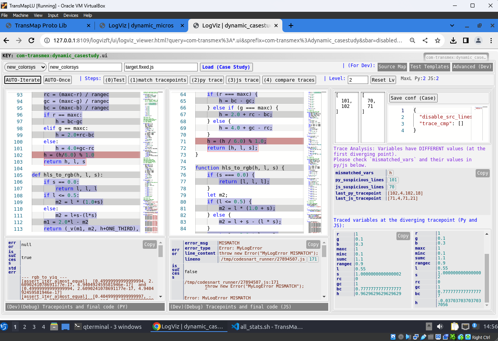
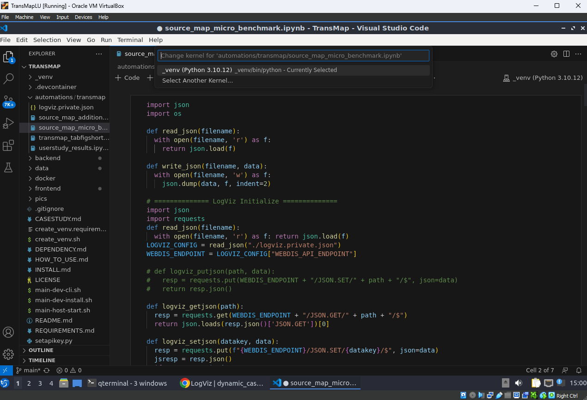
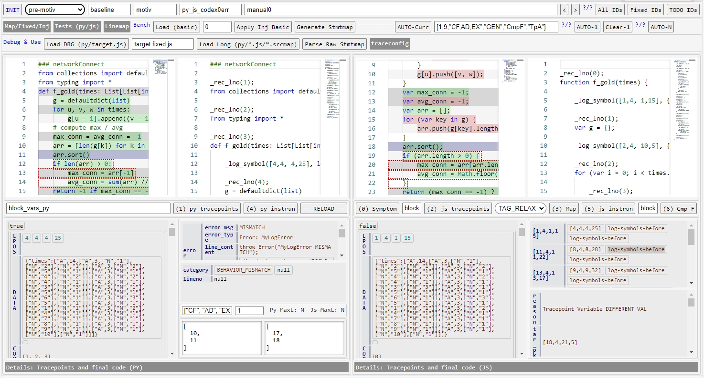

## TransMap Installation Option A: VirtualBox VM

The easiest way to start `TransMap` is to use the VM (`ova` file) we provided. The VM is a virtual box machine. You can download THE `.ova` file from here:  

https://drive.google.com/drive/folders/1c_2neMZXmZdZweBBnsPf3KEXX2ndbW7o?usp=drive_link

Username: `transmap`. Password: `123456`.

The only additional configuration is to provide a real OpenAI API key if you want to test it on your own Python program. Please refer to the section `Set OpenAI API Key` in the end.

**NOTE:** You may want to set port forwarding (forward the SSH port 22 of the VM to the host 3022). This is not required but will be useful if you want to remotely connect to the VM in vscode or ssh. In VirtualBox, after import the VM, you can set it at `Machine`->`Settings`->`Network`->`Advanced`->`Port Forwarding`, and add a rule with `Host Port` as `3022` and `Guest Port` as `22`. Then, you can use `ssh transmap@127.0.0.1 -p 3022` on host to connect to it.

### **Step 1: start LogViz and TransMap Backend**

**NOTE:** Although dependencies are built, internet connection is required to start `TransMap` due to build-and-start script talking to docker/npm etc and for OpenAI API calls.

After booting the VM, you need to open two terminals, one under `~/Desktop/FSEArtifact/TransMap` and one under `~/Desktop/FSEArtifact/LogViz`.

You need to first start `LogViz`. Inside the folder `.../LogViz`, run `./docker-start.sh`. 

After the `LogViz` is successfully booted, open `.../TransMap` and run `./main-host-start.sh`.

Keep the two terminals open like below:



### **Step 2: Load TransMap in the Browser**

After `TransMap` is booted, open Chrome browser and open the following URLs in two tabs in one window in order to load TransMap library and TransMap UI for Micro Benchmarks:

- Prototype Library   
  http://127.0.0.1:18000/frontend/transmap/index_evalex_proto.html?debug=true
- TransMap UI for Micro-benchmarks   
  http://127.0.0.1:8109/logvizft/ui/logviz_viewer.html?query=com-transmex%3A*.ui&sprefix=com-transmex%3Adynamic_micros&sbar=disabled&theme=white

The two browser tabs should look like this:  



**NOTE: There are some other Web UIs that will be useful later:**  

- UI for Collecting Results for Micro-benchmarks  
  http://127.0.0.1:8109/logvizft/ui/logviz_viewer.html?query=com-transmex%3A*.ui&sprefix=com-transmex%3Adynamic_summary&sbar=disabled&theme=white  
- TransMap UI for Case Studies   
  http://127.0.0.1:8109/logvizft/ui/logviz_viewer.html?query=com-transmex%3A*.ui&sprefix=com-transmex%3Adynamic_casestudy&sbar=disabled&theme=white  
- TransMap UI for User Study  
  http://127.0.0.1:8109/logvizft/ui/logviz_viewer.html?query=com-transmex%3A*.ui&sprefix=com-transmex%3Adynamic_userstudy&sbar=disabled&theme=white  


**NOTE: No matter how many Web UI web pages are open, there should be one and only one Prototype Library page kept open in the same window. All the user interfaces will share the TransMap library.**

For exmaple, below is a screenshot of the TransMap UI for Case Studies. Notice that only one Prototype Library page is open in the same window but there are multiple UIs open in different tabs.



### **Step 3: Open `vscode` and choose the `./_venv`  Python environment**

Some part of the evaluation needs Python scripts and Jupyter Notebooks. You can open vscode in the VM and choose to use `./_venv`.



### **Step 4: Set OpenAI API Key**

Please refer to the `Post Installation` section in the end about setting up the OpenAI API key.


## TransMap Installation Option B: Docker Installation

If you use the provided VM, installation steps in this section can be skipped.

### **Step 1: Check basic requirements**
- `x64` architecture (due to compiled cython modules)
- `Docker` with the `docker-compose-plugin` (`Docker 20.10+` recommended. Lower versions are not tested)
- `Linux` (For the starting bash scripts. It is expected to work on any Linux distros, Although we only tested on `Ubuntu 18.04` and `Ubuntu 20.04`)

### **Step 2: Build and run the development container**

Run the command `./main-dev-cli.sh` to automatically build and start the development container. You should enter the container's CLI (`node ➜ /workspace (main ✗) $ `) after this command.

```
$ ./main-dev-cli.sh 
Sending build context to Docker daemon  5.632kB
Step 1/8 : FROM ...
Step 2/8 : RUN apt-get update && export ...
...
Successfully built 412a5e32b87a
Successfully tagged devprojbase:latest
devprojbase-container
node ➜ /workspace (main ✗) $ 
```

### **Step 3: Build all the docker images for evaluating `TransMap`**

Run the command `sudo ./main-dev-install.sh` **inside the development container**.

You should be able to see output like this:
```
node ➜ /workspace (main ✗) $ sudo ./main-dev-install.sh 
========= installing frontend dependencies (node_modules) =========
--------- install monaco ---------
...
+ monaco-editor@0.31.1
updated 1 package and audited 1 package in 3.504s
found 0 vulnerabilities

========= build docker images (using host docker) =========
...
--------- build docker images: nginxbase ---------
Sending build context to Docker daemon  3.584kB
Step 1/2 : FROM nginx:1.21.6
...
Successfully built 4b7c97765cf1
Successfully tagged nginxbase:latest
node ➜ /workspace (main ✗) $ 
```

Then exit the development container. 

### **Step 4: Starting TransMap Services**

Run the command `./main-host-start.sh` **on the host system (outside of the development container)**.

You should be able to see all containers up. On a separate shell, run `docker ps` to check if they are all running normally:

```
$ docker ps
CONTAINER ID   IMAGE               ...   PORTS                 ...
0ffc0c972e77   nginxbase           ...   127.0.0.1:8000->80/tcp...
778018e31fe9   backendmlbase       ...                         ...
3758d4739e43   backendpybase       ...                         ...
e737ac9fb4e6   backendtestingbase  ...                         ...
```

Notice that the `TransMap` is exposed at `127.0.0.1:18000`. Open the browser to load `TransMap` prototyping library:

- http://127.0.0.1:18000/frontend/transmap/index_evalex_proto.html?debug=true  
  
### **Step 5: Install LogViz (The User Interface of TransMap)**

1. Please install the specific version of `LogViz` from the tarball `LogViz-vTransMap.FSE2023.tar.gz` besides the tarball of `TransMap`. Alternatively, you can download the specific version of `LogViz` from here:  

https://drive.google.com/drive/folders/1c_2neMZXmZdZweBBnsPf3KEXX2ndbW7o?usp=drive_link

**After installing LogViz:** Please check if there exists  `./frontend/_api/xapi_logviz.private.js`. If this file doesn't exist, need to create one with the following content (see the values of default `<logviz-hostname>` and default `<logviz-path>` below):

```json
window._LOGVIZ_CONFIG = {
  "WEBDIS_API_ENDPOINT": "http://<logviz-hostname>/<webdis-path>/",
  "LOGVIZ_API_ENDPOINT": "http://<logviz-hostname>/<logviz-path>/api/"
};
```

### **Step 6: Go to TransMap debugging UI in LogViz**

Assuming the LogViz service (Seperated from TransMap) is already up and running (referring to `Additional Installation Requirement`). Load TransMap UI using the following link:

```
http://<logviz-hostname>/<logviz-path>/ui/logviz_viewer.html?query=com-transmex:dynamic*&sbar=disabled
```

**NOTE:** The default `logviz-hostname` is `127.0.0.1:8109`, and the default `logviz-path` is `logvizft`. Thus, the default UI link is:

```
http://127.0.0.1:8109/logvizft/ui/logviz_viewer.html?query=com-transmex:dynamic*&sbar=disabled
```

You should be able to see TransMap UI like this:  


**IMPORTANT:** You must keep **one and only one** TransMap prototyping library open (mentioned in step 4, `http://127.0.0.1:18000/frontend/transmap/index_evalex_proto.html?debug=true`) in the same browser window (a different tab from `LogViz`). `LogViz` will communicate with `TransMap` through browser's message broadcast.

### **Step 7: Create a Python venv Environemnt for Running Python Scripts**

Make sure you have python3.8+ (we tested on Python 3.8) installed. 
```
python3 --version
./create_venv.sh
```
Then, you should be able to enter this venv environment by executing `source _venv/bin/activate` and exit by executing `deactivate`. You should also be able to choose this Python environment in VSCode for Jupyter Notebooks at `./automations/transmap/*.ipynb`.

### **Step 8: Set OpenAI API Key**

Please refer to the `Post Installation` section in the end about setting up the OpenAI API key.


## Post Installation: Set OpenAI API Key

Run `python3 setapikey.py` and then enter a OpenAI API key follow the prompt. It will save the key at the following list of locations:

- `./backend/codex-server/drvtry` 
- `./backend/codex-server/drvtry-beta`
- `./data/transmap/cases/openai.key`
- `./data/transmap/codemap/openai.key`

**NOTE:** If you don't want to try it on new programs, you can fill in any string as the API key, such as `sk-deadbeef`. Most of the API calls for the evaluation are cached. A real API key is required if you test it on new programs (which will cause a cache miss and actually call OpenAI API). 