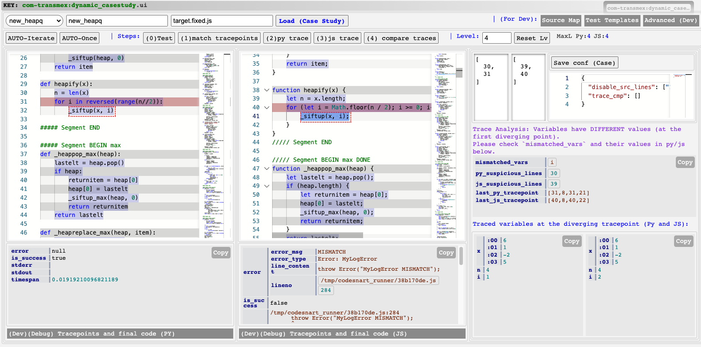

# TransMap: Debugging Code Translation by Codex & ChatGPT

> Paper: **TransMap: Pinpointing Mistakes in Neural Code Translation** in ESEC/FSE 2023



## License

Main part of the code is under MIT license. Some source dependencies have special licenses See [`LICENSE`](./LICENSE) and [`DEPENDENCY.md`](./DEPENDENCY.md) for details.

 
## Introduction

This artifact `TransMap` is a tool to pinpoint mistakes in neural code translation by Codex or ChatGPT. More specifically, it focuses on Python to JavaScript code translation. 

It takes a standalone Python program as input, and then obtains its JavaScript translation and generates a source mapping between statements in the target program and the source program, using Codex or ChatGPT.

Next, it uses the source mapping to aid in tracing the execution of the translated program and comparing it against the source reference program to pinpoint the mistakes in the translation.

## Evaluation Overview

TransMap is evaluated in four aspects:  
- Part A: performance compared to the baseline approach (Table 1),
- Part B: source mapping accuracy on micro benchmarks and additional experiments (Section 6.5 para 2, para 3, and Table 4),
- Part C: case studies on real-world programs (Table 2),
- Part D: user study on 24 participants (Table 3).

Besides, there are benchmark statistics (Table 1 left, figure 6 and figure 2). These statistics are produced by Part A also.

### A. Micro Benchmarks Evaluation

The three sets of micro benchmarks for pinpointing translation mistakes with manually validated list of mistakes are at: 

- GeeksForGeeks: `data/transmap/tests/evalex/gfg`
- LeetCode: `data/transmap/tests/evalex/leetcode`
- HumanEvalX: `data/transmap/tests/evalex/humanevalx`

Each benchmark contains the following files:

- `injects.json` List of mistakes and patches. 
- `target.fixed.js` Fixed translation.  target.js.run.json
- `target.js` translated program with mistakes.
- `source.py` source program.
- `source_test.py` test wrapper for source program.
- `target_test.js` test wrapper for the translated program.

Please see the section `Step-by-Step Instructions for A and B` below for how to run the experiments.

### B. Source Mapping Accuracy

We evaluate source mapping accuracy on micro benchmarks and additional experiments:

- Source Mapping Accuracy on Micro Benchmarks: Same files as above.
- Source Mapping Accuracy under different styles of code: `data/transmap/codemap/`

Please see the section `Step-by-Step Instructions for A and B` below for how to run the experiments.

### C. Case Studies

There are 5 Python modules used for the case study. Some lengthy programs are split into multiple files. The case studies are at:

- Python modules used for case studies: `data/transmap/tests/evalex/real/*`
- Python code to translate them and generate source maps: `data/transmap/cases/*.py`

Please refer to [CASESTUDY](./CASESTUDY.md) for details.

### D. User Study

There are 8 short programs and 4 long code segments used for a user study with 24 participants. 

Please refer to [USERSTUDY](./USERSTUDY.md) for details.

## Step-by-Step Instructions for A and B

### **Step 1: Start TransMap services**

Please refer to [INSTALLATION](./INSTALL.md).


### **Step 2: Evaluate TransMap and Baseline Approaches on 3 sets of Micro Benchmarks, export generated source maps**

First follow Step 1 to open one and exactly one web page of TransMap Prototyping Library. Then, open the TransMap UI for micro-benchmarks (mentioned in Step 1). 


**LeetCode Benchmarks**

1. *Initialize.* Open TransMap UI (refer to [INSTALLATION](./INSTALL.md)). Choose `pre-leetcode` in the drop-down menu at the top.  Click `INIT & Load Bench IDs`.   

2. *Run TransMap and Baseline.* Click `AUTO-N` **once and only once** to run all benchmarks.   
  **NOTE:** If you accidently click `AUTO-N` twice, two concurrent scripts will conflict and the results will be messed up. However, you can simply reload the webpage and start again to overwrite.
3. *Export Generated Source Maps.* Click `AUTO-MAP-N` once to export all generated source maps.   
  **NOTE:** Similarly, please click it only once.


The evaluation results (TransMap and baseline) are saved to `data/transmap/tests/tempex/dynamic/leetcode/py_js_codex0err`. 

The exported source maps are saved to `data/transmap/tests/tempex/dynamic/leetcode/_srcmap_py_js_codex0err`.

**GFG Benchmarks**  

Similar as above. Though unecessary, it is suggested to refresh the TransMap prototyping library and the TransMap UI webpage to trigger a browser memory cleanup. 

Choose `pre-gfg` in the drop-down menu at the top. The rest is the same as above. 

The files will be saved to `.../gfg/py_js_codex0err` and `.../gfg/_srcmap_py_js_codex0err`.

**HumanEvalX benchmarks**

Similar as above. Choose `pre-humanevalx` in the drop-down menu at the top this time.

The files will be saved to `.../humanevalx/py_js_codex0err` and `.../humanevalx/_srcmap_py_js_codex0err`.

### **Step 3: Collect the Benchmark Statistics and Evalation Results for TransMap and the Baseline Approach**

1. Results Collection.  
    Open the `UI for Collecting Results for Micro-benchmarks` according to [INSTALLATION](./INSTALL.md). Choose `leetcode` in the dropdown menu and click `Load IDs`. Then click `Collect Summary` once and wait until the metadata is displayed below the button. After that, click `Collect Summary Per Mistake` and wait until the metadata is displayed below the button. Repeat the same steps for `gfg` and `humanevalx`.
  

2. Compute Statistics.  
    Open the jupyter notebook at `automations/transmap/transmap_tabfigshort.ipynb` in vscode (select the `_venv` environment mentioned in [INSTALLATION](./INSTALL.md)). Run all the cells one by one. 

    All the statistics for part A and benchmark statistics are printed, including Table 1, Figure 6.    
    
    **NOTE:**  Figure 6 vector graph is generated by `automations/transmap/micro_benchmark_pie.ipynb`. Figure 2 is manually drawn (From the data in Figure 6 and Table 1, we can draw Figure 2).

### **Step 4: Validate Source Map Generations for Micro-benchmarks**

For this step, we directly open `automations/transmap/source_map_microbenchmark.ipynb` and run all the cells one by one. It will print out the statistics for part B. 

**NOTE:** The correctness of some source maps are manually checked. The manually checked cases are recorded in the notebook as a literal Python dictionary.


### **Step 5: Additional Source Mapping Experiments**

For additional experiments, the scripts are provided in `data/transmap/codemap/`.  

Please run the following in order:

```
./all_gen.sh
./all_query.sh
./all_stats.sh
```

**NOTE 1:** Below explains the purpose of the Python scipts involved (you don't need to run them manually).
- `cm_0_shuffle_copy.py`: to copy micro-benchmark programs to the current folder for further steps.
- `cm_script*.py`: to generate different styles of translations.
- `cm_1_mapall.py`: to get the source mapping for all styles of translations.
- `cm_3_counterr.py`: to perform sanity checks on the source mapping.

**NOTE 2:** Some of the source maps are manually checked. The manually checked cases are recorded at `cm_3_counterr.*.ERRMANUAL.log`. After you run the above commands, you can diff it with `cm_3_counterr.*.ERROR.log` to see the cases that are different after manual inspection.

After running the above commands, you can open `automations/transmap/source_map_additional_exp.ipynb` and run all the cells one by one. It will print out the statistics for part B (including stats in Section 6.5 and Table 4).

## Reusability: Use TransMap on Your Own Python Program

Please see [HOW_TO_USE](./HOW_TO_USE.md).

## Repo Structure

TransMap's core logic is implemented in JavaScript while necessary file access and program execution are delegated by Python backend. `TransMap` has a dependency named `LogViz` that is provided in a different tarball.

- `.devcontainer`: Resource for building development container
- `automations/transmap/`: Jupyter Notebooks for showing aggregate results
- `backend`
  - `file-server`: Delegate File I/O for TransMap
  - `test-server`: Delegate testing for TransMap
  - `codex-server`: Delegate Codex for TransMap
- `docker` Resource for building the images for TransMap
- `frontend`
  - `_api`: Wrapping backend APIs as functions in frontend
  - `_common`: Libraries for TransMap (tree-sitter)
  - `transmap`: TransMap Prototyping Library (core functionalities)
- `data`
  - `codemap`: related to the source mapping experiments
  - `tests/evalex/<gfg|leetcode|humanevalx>`: microbenchmarks
  - `tests/evalex/real`: case studies
  - `tests/cases`: some scripts for case studies
  - `tests/tempex`: outputs of TransMap on microbenchmarks